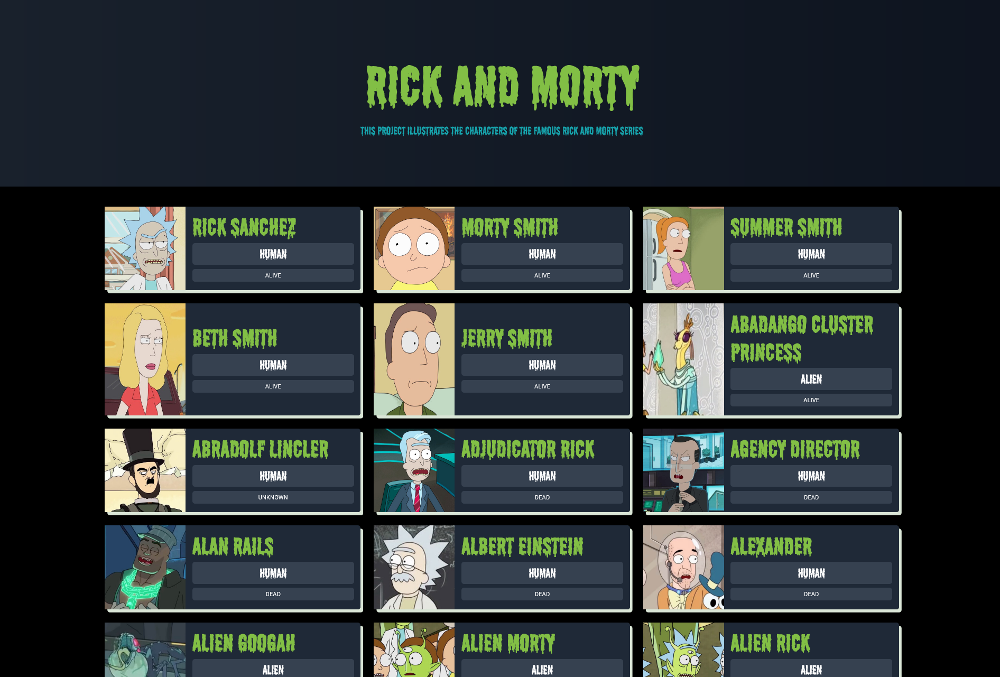

# Rick & Morty Api

<p align="center">
  
</p>

## About The Project

The rick and morty api is a simple project that testes the rick and morty api page with the power of React. As a user, you might see some main characters form the series, the race and their life status


## Table of Contents

<br />

- [About the Project](#about-the-project)
- [Built With](#built-with)
- [How to play](#how-to-play)
- [Contributing](#contributing)
- [Contact](#authors)
- [Acknowledgements](#acknowledgements)
- [Getting Started](#getting-started)
- [Live Demo](#live-version)

#

<br />

 <br/>
 <br/>
 <br/>

## Screenshot

<p align="center">
  
</p>

### Built With

- [JAVASCRIPT] [REACT] [SASS] [API]

<br />

## Live Version

- [Live Demo](https://sergiocortessat.github.io/React_Rick-MortyAPI/)

<!-- ABOUT THE PROJECT   -->

<br />

## Contributing

Contributions make the open-source community such an amazing place to learn, inspire, and create. Any contributions you make are **greatly appreciated**.

## Prerequisites

Terminal or similar to execute the program.

## Getting Started

## Clone project

- To get a local copy up and running follow these simple example steps.
- Clone this repository with git clone `https://github.com/sergiocortessat/React_Rick-MortyAPI/` using your terminal or command line.
- Change to the project directory by entering: `cd React_Rick-MortyAPI` in the terminal.
- Enter the command npm i
- Enter the project folder and run locally by using npm start.
- If the project cant be build, please run npx webpack.

## Command line steps

```
- $ git clone `$ git clone https://github.com/sergiocortessat/React_Rick-MortyAPI
- $ git checkout develop
- $ cd JSCapstone-PlatformGame
- $ npm i
- $ npm start
- ##(If project doesn't build, please run): $ npx webpack
```

## Authors

👤 Sergio Cortes Satizabal

- Github: [@sergiocortessat](https://github.com/sergiocortessat)
- Twitter: [@sergiocortessat](https://twitter.com/sergiocortessat)
- LinkedIn: [@sergiocortessat](https://linkedin.com/in/sergiocortessat)

<!-- ACKNOWLEDGEMENTS -->

## Acknowledgements

- [Microverse](https://www.microverse.org/)

## 📝 License

This project is [MIT](https://github.com/sergiocortessat/sergiocortessat/blob/main/LICENSE) licensed.
